# SSDF-Datasets

This repository contains multiple synthetic datasets of semantically segmented road-scene images, which have been created as part of the [SSDF](https://project-page) project.
See [Perception package](https://github.com/Unity-Technologies/com.unity.perception) to see how we generate data.
Visit the [our github page](hcmus-robotics.github.io) for more information on our tools and project.

## Table of Datasets

| Dataset name                  | Type                  | Link                                                                          | Format | Details                              |
| ----------------------------- | --------------------- | ----------------------------------------------------------------------------- | ------ | ------------------------------------ |
| UIT-segmentation-round1-map1  | semantic segmentation | [link](https://gitlab.com/wan2000/unitydatasets/-/tree/main/UIT-round1-map1)  | Lyft   | From UIT racing car competition 2020 |
| UIT-segmentation-round1-map2  | semantic segmentation | [link](https://gitlab.com/wan2000/unitydatasets/-/tree/main/UIT-round1-map2)  | Lyft   | From UIT racing car competition 2020 |
| UIT-segmentation-round2       | semantic segmentation | [link](https://gitlab.com/wan2000/unitydatasets/-/tree/main/UIT-round2)       | Lyft   | From UIT racing car competition 2020 |
| FPT-segmentation-round1       | semantic segmentation | link                                                                          | Lyft   | From FPT racing car competition 2020 |
| UIT-object-round1             | object detection      | comming soon                                                                  | COCO   | From UIT racing car competition 2020 |
| UIT-object-round2             | object detection      | comming soon                                                                  | COCO   | From UIT racing car competition 2020 |
| UIT-object-round3             | object detection      | comming soon                                                                  | COCO   | From UIT racing car competition 2020 |
| UIT-lane-round1               | lane detection        | comming soon                                                                  | CULane | From UIT racing car competition 2020 |
| UIT-lane-round2               | lane detection        | comming soon                                                                  | CULane | From UIT racing car competition 2020 |
| UIT-lane-round3               | lane detection        | comming soon                                                                  | CULane | From UIT racing car competition 2020 |

## Segmentation Datasets

Some information

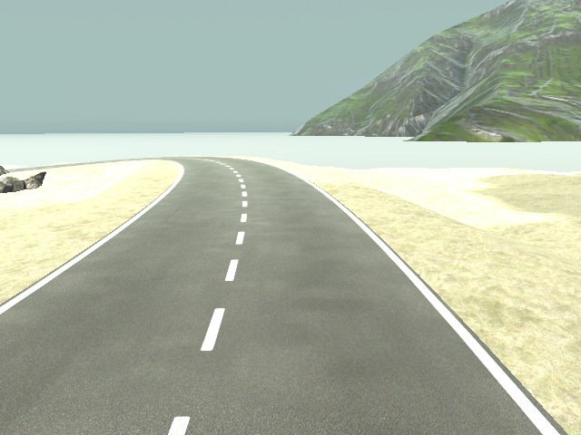 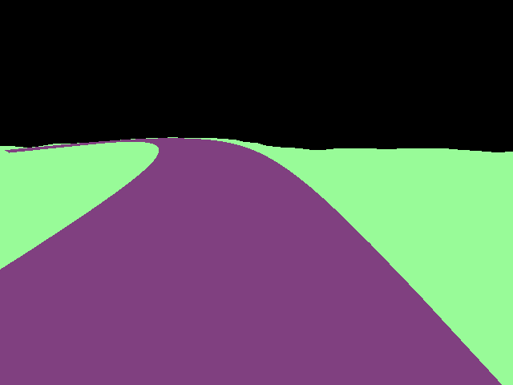 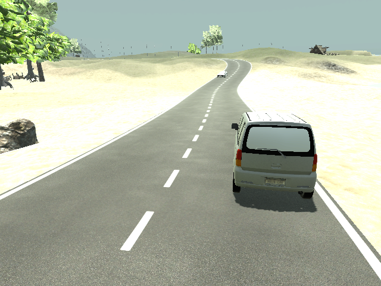 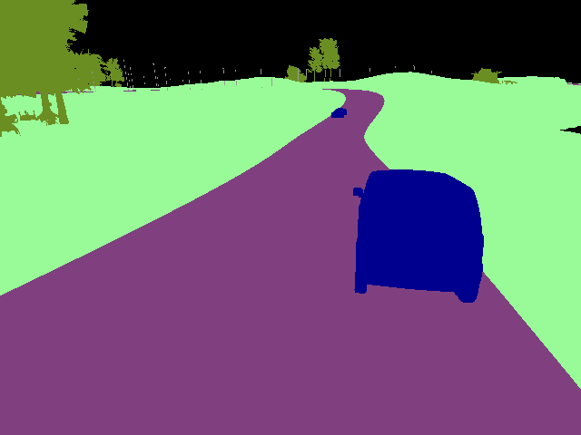
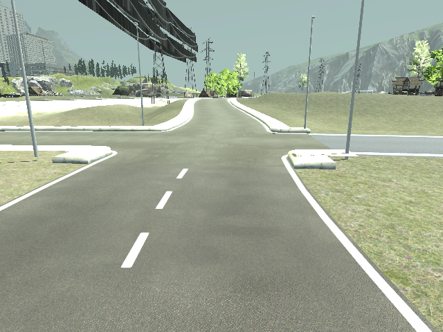 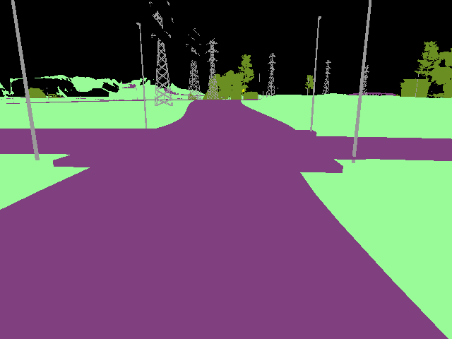
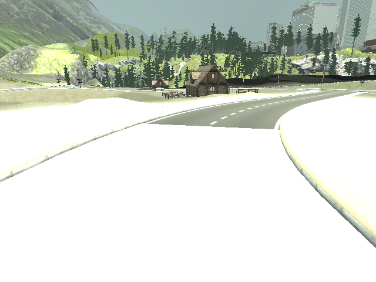 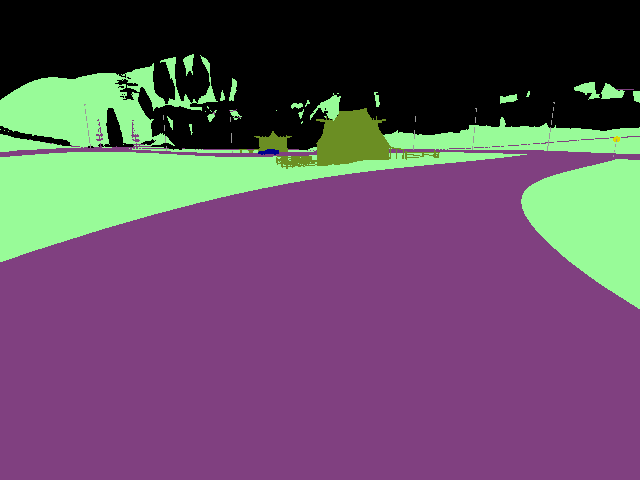
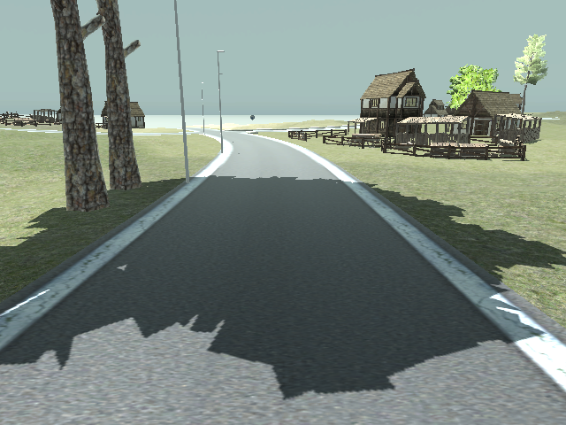 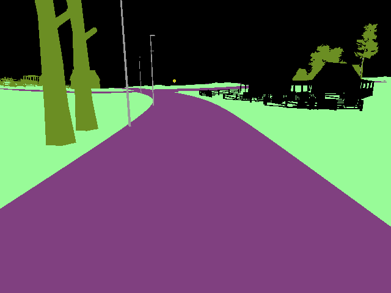
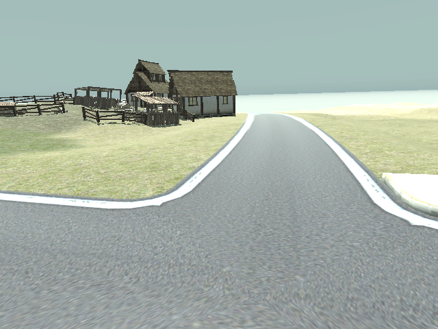 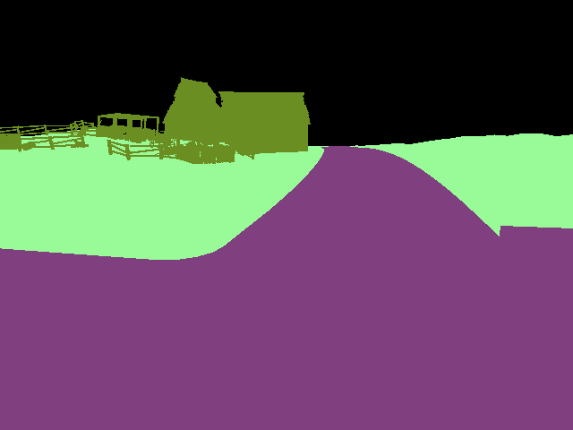

## Object detection datasets

coming soon

## Lane datasets

coming soon
